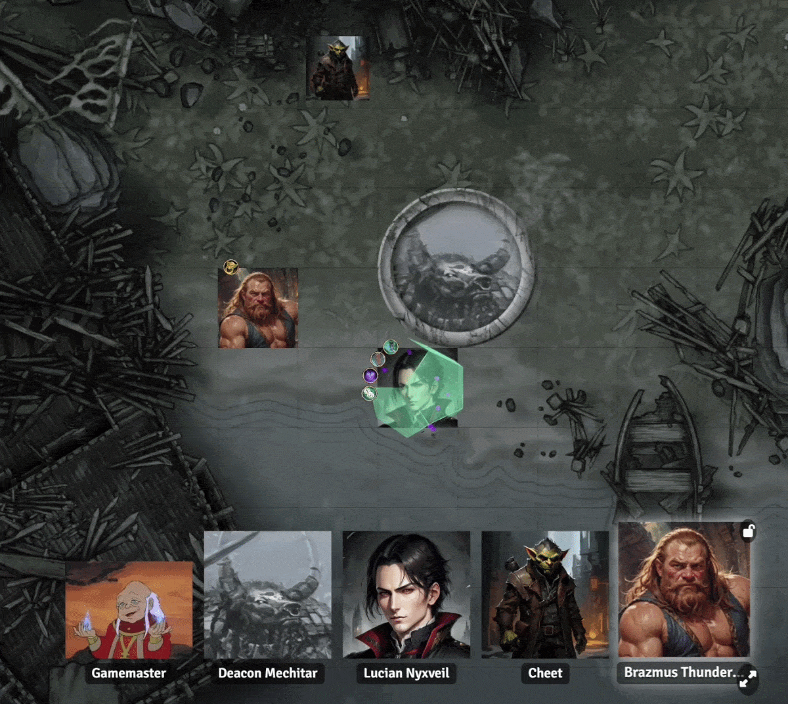

## Reactive Discord Portraits

Max Headroom displays Discord voice activity inside Foundry VTT,
including multiple simultaneous speakers. I'd like to bring the joy of a fancy OBS overlay production to us average users with only a few .png's to our name!

# Foundry VTT Max Headroom

Max Headroom displays reactive Discord voice portraits directly inside Foundry VTT. Portraits can change when a Discord user speaks or mutes, giving the table a visual indication of voice activity without requiring OBS inside Foundry. The portrait can be animated .webp format images, or any of the usual image formats that Foundry accepts. 

Max Headroom is my own spagetti and is not affiliated with or endorsed by Foundry Gaming LLC, Discord Inc., Google, or anybody important.

## Requirements

Please note that Max Headroom requires a couple additional steps of setup from the GM only in order to link Discord and Foundry communication. One component is the offical lightweight Discord Streamkit, though no actual streaming is involved. The other component is a small browser extension to allow the Discord Streamkit and Foundry to talk. This extension is small, simple, and verified by the Chrome Web Store. Please read on for more detailed setup.

Max Headroom requires:

- **Foundry VTT v14**
- **The Chrome Web Store-validated Max Headroom Companion extension** in a Chromium-based browser like... Chrome.
- **Discord StreamKit** : a free non-installed web browser overlay for Discord

Only the GM acting as the **Relay Host** needs the companion extension and StreamKit. Other Foundry users receive portrait state through Foundry and do not need to install the extension or anything else.

---

# 1. Authorize Discord StreamKit First

Do this before configuring Foundry. Only the GM will need to do this.

1. Open the Discord desktop application and sign in to the account you will use for the game.
2. Go to **https://streamkit.discord.com/overlay**.
3. Click **Install for OBS**. You do not need OBS; this is Discord's normal StreamKit authorization path. Despite Discord's choice of words, this is not an application install.
4. When Discord asks for permission, **accept/authorize StreamKit Overlay**.
5. Switch to the **Voice Widget** tab.
6. Select the Discord server and **voice channel** used by your group. This can be changed later.
7. Copy the **Voice Widget** overlay URL for later use in Foundry.

Verify the authorization in:

**Discord -> User Settings -> Connected Apps -> Authorized Apps**

You should see **Streamkit Overlay** down near the bottom. If you do not, you may have denied overlay's permissions and should try again.

Once authorization is complete, Max Headroom uses the configured **Voice Widget** overlay, opened via URL, during play.

---

# 2. Install the Foundry Module

This is needed if not found and installed via the Foundry VTT module browser, which I am applying for.

Repository:

**https://github.com/HetzenGN/Foundry-VTT-Max-Headroom**

Manifest URL:

**https://github.com/HetzenGN/Foundry-VTT-Max-Headroom/releases/latest/download/module.json**

In Foundry:

1. Open **Setup -> Add-on Modules -> Install Module**.
2. Paste the manifest URL above.
3. Install the module.
4. Launch your world.
5. Enable **Max Headroom** in Module Management.

Max Headroom is for **Foundry VTT v14 only**. I plan on keeping this updated for future Foundry releases.

---

# 3. Install the Browser Companion

Only the GM, who will act as Relay Host, must install the Max Headroom Companion extension. If you have a Co-GM, who will need Foundry GM permissions, whoever takes the "Relay Host" chair must have the extension installed and paired.

Chrome Web Store:

**https://chromewebstore.google.com/detail/foundryvtt-max-headroom-r/eflhnldiekdfiaddmjmbodhkaabhgeno**

After installing it:

1. Open your Foundry world in the same Chromium-based browser.
2. Open the Max Headroom Companion extension popup. This should be in a small "Extension" clickable in the top right.
3. Click **Pair Current Foundry Tab** while on the game tab.
4. Confirm the popup identifies the paired Foundry world and user. Not everything will go green until the Streamkit is open as well.

If you later move to another Foundry tab, use **Re-pair Current Foundry Tab**. **Forget Pairing** clears the current session pairing.

---

# 4. Configure the StreamKit URL

Open **Configure Settings -> Module Settings** in Foundry and find the Max Headroom settings. Only the GM will need to do this.

Set **StreamKit Relay URL** box to the Discord **Voice Widget** URL you copied earlier. This should not be simply "https://streamkit.discord.com/overlay", but be longer with specifics. This URL identifies the Discord server and voice channel used by your group.

The Relay Controller's **Open StreamKit** button launches this pasted URL.

You can also adjust portrait presentation settings such as:

- Portrait Bar Anchor
- Portrait Bar Orientation
- Portrait Tile Size
- Show User Names
- Speech Decay
- Speaking Animation

The defaults should work for most. These GM bar size/position settings will appear as the default for players until they further customize them.

---

# 5. Start the Discord Relay

Open the **Max Headroom Relay Controller** in Foundry. Its Setup section tracks four items:

- **Relay Host**
- **Browser Companion**
- **Discord StreamKit**
- **Reactive Portraits**

## Claim Relay Host

Click **Claim Relay Host**. Only one connected GM should own relay authority at a time. That GM will use their companion extension and Streamkit overlay window to pass activity to your player's clients.

## Open StreamKit

Make sure the companion is paired, then:

1. Join the intended Discord voice channel.
2. Click **Open StreamKit** in the Relay Controller.
3. Leave the StreamKit Voice overlay open while playing. You can minimize this but it must stay open.

The **Browser Companion** setup indicator does not turn green when the extension is first installed but will turn green once there is talking between Discord, the extension, and Foundry.

Once traffic is flowing, the Relay Controller should begin showing detected Discord users voice activity.

---

# 6. Configure Reactive Portraits

In the Relay Controller, find **Reactive Portraits** and click **Configure**.

Foundry Users appear in collapsible rows. Each row shows the Foundry User and an **Enabled** checkbox. Expand a user to configure mapping, portrait name, images, and sort order.

## Enable and Map a User

Check **Enabled** for each Foundry User who should appear in the portrait bar.

Open the **Discord User** dropdown. With StreamKit authorized and running, users currently detected in voice should appear under **Detected in Voice**. Select the Discord account belonging to that Foundry User. Having these names passed over is a lot more convenient then manually trying to populate them; I'd suggest testing by mapping the GM, but save the Foundry User -> Discord mapping for the final step once you do have your players in voice.

A manual **Discord ID** field is available if you do need/want to preconfigure it. Discord users can click their own profile and "Copy Discord ID" in their own Discord app, then send it to you.

## Choose the Portrait Name

Each user can display:

- **Player** — the Foundry User name like in User Configuration
- **Player Character** — the character currently assigned in Foundry User Configuration
- **Custom** — text entered in Custom Name

When **Player Character** is selected, changing that user's assigned Foundry character should change the portrait name. 

Names that end up being too long will be truncated, but you may want to use a shorted Custom name instead.

## Choose Reactive Images

Each enabled user can have:

- **Idle Image**
- **Talking Image**
- **Muted Image**

These are independent from Actor portraits, Tokens, character artwork, Foundry User avatars, and anything else.

For animated portraits that activate a speaking loop the animations must be in .webp format only. For reactive, but static images, any of the normal Foundry image formats should work.

Use the folder button to select artwork. Neither Talking or Muted must be set, but the image will stay as Idle.

Use **Sort Order** to control portrait order, then click **Save Configuration**.

---

# 7. Test the Setup

A basic test sequence:

1. Confirm you (GM) are the Relay Host.
2. Confirm the Browser Companion is connected and paired to the correct tab.
3. Confirm StreamKit is open. This should be the overlap browser tab and not the Streamkit config panel that had Voice Widget.
4. Join the configured Discord voice channel.
5. Confirm Discord users appear in Configure Reactive Portraits.
6. Speak and verify the mapped portrait changes to Talking.
7. Stop speaking and verify it returns to Idle. (after speech decay)
8. Mute and verify the Muted state works and image is shown.
9. Test two users speaking at the same time.

Other Foundry users should see the same portrait activity. They won't need the extension or Streamkit, so it stays easy for them.

---

# Troubleshooting

## Browser Companion does not turn green

Check that the extension is installed, the current Foundry tab is paired, you the GM are the Relay Host, and StreamKit is open. Installing the extension alone is not enough; Foundry must receive StreamKit relay activity.

## Speaking works, but Discord names do not appear

Check:

**Discord -> User Settings -> Connected Apps -> Authorized Apps**

Make sure **Streamkit Overlay** is present. If it is missing:

1. Return to **https://streamkit.discord.com/overlay**.
2. Click **Install for OBS**.
3. Accept the authorization/permission prompt. 
4. Reopen the configured StreamKit overlay.
5. In **Configure Reactive Portraits**, click **Refresh Discord List**.

If the portraits work after manually setting a Discord ID, but you do not see player names in the dropdown, then it is certainly Streamkit Overlay permissions.

## No Discord users are detected

Confirm the Relay Host is in the voice channel selected for the StreamKit Voice Widget and that **StreamKit Relay URL** points to that voice overlay. Reopen StreamKit, then use **Refresh Discord List**.

## Another GM owns the relay

Only one GM can be Relay Host. Continue using that GM or have them switch the claim.

## A portrait does not appear

Confirm the Foundry User is **Enabled**, mapped to the correct Discord user, has an Idle image selected, and the configuration was saved.

---

# Privacy

Max Headroom does **not** record Discord voice audio and does not read Discord text-message contents. It uses the information needed for reactive portraits, such as Discord user IDs, usernames or server nicknames, voice-channel presence, speaking state, mute state, and relay health. Feel free to open up the Console on the Streamkit Overlay tab and you can poke around the relay packets.

User mappings are persistent for Foundry for each of configuring between player parties.

---

# Quick Setup Checklist

- [ ] Discord desktop app is running
- [ ] StreamKit Overlay authorized through **Install for OBS**
- [ ] **Streamkit Overlay** appears under Discord Authorized Apps
- [ ] Voice Widget configured for the correct server/channel
- [ ] Foundry VTT Max Headroom installed and enabled
- [ ] Max Headroom Companion installed from the Chrome Web Store
- [ ] Current Foundry tab paired
- [ ] StreamKit Relay URL set to the Voice Widget URL
- [ ] GM has claimed Relay Host
- [ ] StreamKit Voice overlay is open
- [ ] Discord users are detected
- [ ] Enabled Foundry Users are mapped
- [ ] Reactive images are configured
- [ ] Speaking and mute behavior tested

Once setup is complete, normal use is much simpler: keep the Relay Host's Foundry tab, paired companion, Discord desktop client, and StreamKit Voice overlay running. Reactive portraits will update automatically during play for all your players.
